# Voxium - Architecture Document

## Table of Contents

1. [System Overview](#system-overview)
2. [High-Level Architecture](#high-level-architecture)
3. [Technology Stack](#technology-stack)
4. [Backend Architecture](#backend-architecture)
5. [Frontend Architecture](#frontend-architecture)
6. [Database Design](#database-design)
7. [Real-Time Communication](#real-time-communication)
8. [Voice Architecture](#voice-architecture)
9. [Authentication & Security](#authentication--security)
10. [Scalability Strategy](#scalability-strategy)
11. [Deployment Architecture](#deployment-architecture)
12. [Future Architecture](#future-architecture)

---

## System Overview

Voxium is a real-time communication platform enabling users to create communities (servers), organize conversations into channels, and communicate via text messages and voice chat. The system is designed to handle 1,000+ concurrent users in V1, with a clear path to scale to millions.

### Core Principles

- **Real-time first:** All interactions are immediately reflected across connected clients
- **Low latency:** Voice and messaging prioritize sub-100ms delivery
- **Horizontal scalability:** Stateless services behind load balancers
- **Cross-platform:** Single codebase serves Windows, macOS, Linux, and web browsers (future: mobile)
- **Privacy-first:** No third-party services — all traffic stays on user's own infrastructure
- **Security:** JWT auth, input validation, rate limiting, CORS protection

---

## High-Level Architecture

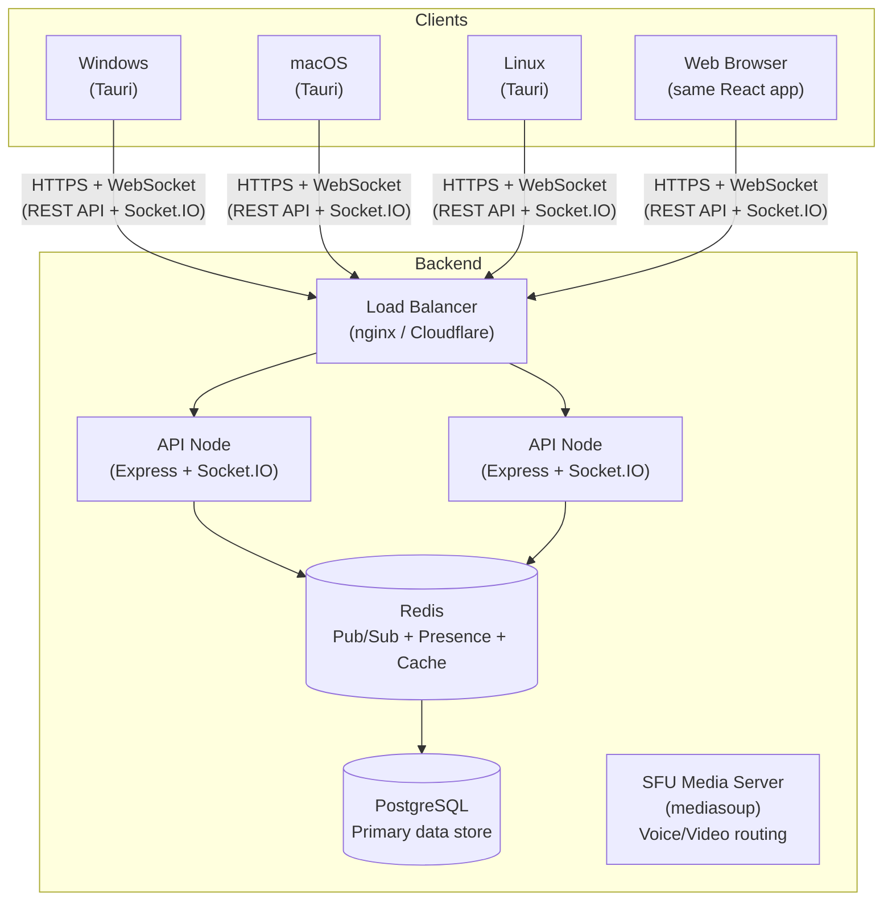

---

## Technology Stack

### Backend
| Layer | Technology | Version |
|-------|-----------|---------|
| Runtime | Node.js | 20+ |
| Language | TypeScript | 5.6+ |
| HTTP Framework | Express.js | 5.x |
| WebSocket | Socket.IO | 4.8 |
| ORM | Prisma | 7.x (driver adapter pattern) |
| Database | PostgreSQL | 16 |
| DB Driver | @prisma/adapter-pg | 7.x |
| Cache / Pub/Sub | Redis (node-redis) | 5.x |
| Voice (SFU) | mediasoup | 3.x |
| Auth | JWT (jsonwebtoken) | 9.x |
| Rate Limiting | rate-limiter-flexible | 9.x |
| Password Hashing | bcryptjs | 3.x |
| File Storage | S3-compatible (OVH) | — |
| S3 Presigning | @aws-sdk/s3-request-presigner | — |
| Email | Nodemailer | 8.x |

### Frontend
| Layer | Technology | Version |
|-------|-----------|---------|
| Framework | React | 19 |
| Language | TypeScript | 5.6+ |
| Build Tool | Vite | 7.x |
| Desktop Shell | Tauri | 2.x |
| Styling | Tailwind CSS | 4.x (CSS-first `@theme` config) |
| State | Zustand | 5.x |
| Routing | React Router | 7.x |
| HTTP Client | Axios | 1.x |
| WebSocket Client | socket.io-client | 4.8 |
| WebRTC | Native RTCPeerConnection | — |
| Icons | Lucide React | — |

### Infrastructure
| Component | Technology |
|-----------|-----------|
| Containers | Docker + Docker Compose |
| Orchestration (future) | Kubernetes |
| CI/CD | GitHub Actions (lint, typecheck, build, release, Docker) |
| Monitoring (future) | Prometheus + Grafana |

---

## Backend Architecture

### Directory Structure

```
apps/server/
├── prisma/
│   ├── schema.prisma       # Database schema
│   └── seed.ts             # Demo data seeder
├── src/
│   ├── index.ts            # Entry point, server bootstrap
│   ├── app.ts              # Express app configuration, middleware, routes
│   ├── routes/
│   │   ├── auth.ts         # Register, login, refresh, me, forgot/reset/change password
│   │   ├── servers.ts      # CRUD servers, join/leave, members, settings, member search
│   │   ├── channels.ts     # CRUD channels, mark-as-read, bulk reorder
│   │   ├── categories.ts   # CRUD categories, bulk reorder
│   │   ├── messages.ts     # CRUD messages with pagination, reactions, @mention resolution
│   │   ├── dm.ts           # DM conversations, messages, reactions, read tracking, deletion
│   │   ├── users.ts        # User profiles, profile update with real-time broadcast
│   │   ├── invites.ts      # Create/use/preview invites
│   │   ├── uploads.ts      # Presigned URL generation (S3) + proxy streaming for attachments + GET redirect for public assets
│   │   ├── friends.ts      # Friend requests (send/accept/decline/remove), friendship status
│   │   ├── search.ts       # Full-text message search (server channels + DM conversations)
│   │   ├── reports.ts      # User-facing report submission
│   │   ├── support.ts      # User-facing support ticket routes
│   │   ├── roles.ts        # Role CRUD, member role assignment, channel permission overrides
│   │   ├── themes.ts       # Community theme marketplace (CRUD, publish/unpublish, install/uninstall, admin moderation)
│   │   ├── admin.ts        # Admin API (users, servers, bans, storage, reports, support, rate limits, feature flags, audit log, export)
│   │   └── stats.ts        # Public stats endpoint
│   ├── services/
│   │   └── authService.ts  # Auth business logic
│   ├── middleware/
│   │   ├── auth.ts         # JWT authentication middleware
│   │   ├── rateLimiter.ts  # Per-endpoint + per-socket rate limiting (Redis-backed registry, admin-editable)
│   │   ├── requireSuperAdmin.ts # Admin/superadmin role guards
│   │   └── errorHandler.ts # Global error handler
│   ├── websocket/
│   │   ├── socketServer.ts  # Socket.IO setup, connection handler
│   │   ├── voiceHandler.ts  # Voice channel state management
│   │   ├── dmVoiceHandler.ts # DM call signaling + system messages
│   │   └── adminMetrics.ts  # Live metrics emitter for admin dashboard
│   └── utils/
│       ├── prisma.ts            # Prisma client singleton (v7 adapter pattern via @prisma/adapter-pg)
│       ├── redis.ts             # Redis client + presence helpers
│       ├── errors.ts            # Custom error classes
│       ├── sanitize.ts          # HTML stripping + text sanitization utility
│       ├── s3.ts                # S3 client + presigned URL generation + delete helper + getS3Object proxy + VALID_S3_KEY_RE
│       ├── email.ts             # Nodemailer transporter + password reset email + cleanup report email
│       ├── attachmentCleanup.ts # Scheduled job (daily 4 AM) — expires attachments older than retention period, deletes from S3, emails report
│       ├── reactions.ts         # Shared reaction aggregation (channels + DMs)
│       ├── mentions.ts          # @mention extraction, resolution, batch resolution (server members only)
│       ├── memberBroadcast.ts   # Server room join + member event broadcast
│       ├── auditLog.ts         # Fire-and-forget audit event logger
│       └── featureFlags.ts     # Redis-backed feature flag registry
```

### Request Flow

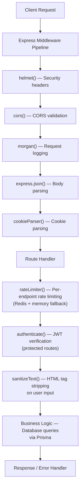

### Error Handling

Custom error classes provide structured HTTP error responses:

```typescript
AppError (base)
├── BadRequestError     (400)
├── UnauthorizedError   (401)
├── ForbiddenError      (403)
├── NotFoundError       (404)
└── ConflictError       (409)
```

All unhandled errors return a generic 500 response without leaking internals.

---

## Frontend Architecture

### Directory Structure

```
apps/desktop/
├── src/
│   ├── main.tsx              # React entry point
│   ├── App.tsx               # Root component with routing
│   ├── pages/
│   │   ├── LoginPage.tsx          # Login form + forgot password link + peeking thief
│   │   ├── RegisterPage.tsx       # Registration form + peeking thief
│   │   ├── ForgotPasswordPage.tsx # Email input → sends reset link
│   │   ├── ResetPasswordPage.tsx  # Token-based new password form
│   │   └── InvitePage.tsx         # Invite preview + join
│   ├── components/
│   │   ├── layout/
│   │   │   ├── MainLayout.tsx    # 3-panel Discord-like layout
│   │   │   └── ToastContainer.tsx # Fixed-position toast notification overlay
│   │   ├── auth/
│   │   │   ├── AuthBackground.tsx     # Animated auth page background
│   │   │   └── PeekingThief.tsx       # SVG thief character (reacts to password typing)
│   │   ├── server/
│   │   │   ├── ServerSidebar.tsx      # Server icon strip (far left)
│   │   │   ├── CreateServerModal.tsx  # Create/join server with icon upload
│   │   │   ├── ServerSettingsModal.tsx # Edit server name/icon (owner only)
│   │   │   └── MemberSidebar.tsx      # Member list (far right)
│   │   ├── channel/
│   │   │   └── ChannelSidebar.tsx # Channel list (left panel)
│   │   ├── common/
│   │   │   ├── Avatar.tsx           # Shared avatar with img/initials fallback
│   │   │   ├── EmojiPicker.tsx      # Portal-based emoji picker (shared)
│   │   │   ├── UserHoverTarget.tsx  # Hover wrapper → UserProfilePopup
│   │   │   └── UserProfilePopup.tsx # User profile card (server members + API fallback for DMs)
│   │   ├── chat/
│   │   │   ├── ChatArea.tsx         # Server chat container
│   │   │   ├── MessageList.tsx      # Scrollable message list
│   │   │   ├── MessageItem.tsx      # Single message with edit/delete/reactions/mention highlight
│   │   │   ├── MessageContent.tsx   # Mention-aware content rendering (text + @mention badges)
│   │   │   ├── MentionAutocomplete.tsx # @mention autocomplete (server-side search, keyboard nav)
│   │   │   ├── MessageInput.tsx     # Message composer (channels + DMs)
│   │   │   ├── ReactionDisplay.tsx  # Reaction chips (channels + DMs)
│   │   │   └── DeleteConfirmModal.tsx # Message delete confirmation
│   │   ├── dm/
│   │   │   ├── DMList.tsx           # Conversation list with unread badges
│   │   │   ├── DMChatArea.tsx       # DM chat view + call UI
│   │   │   ├── DMMessageList.tsx    # DM scrollable messages with system msgs
│   │   │   ├── DMCallPanel.tsx      # Discord-style call UI (avatars, controls)
│   │   │   └── IncomingCallModal.tsx # Incoming call accept/decline + looping ringtone
│   │   ├── friends/
│   │   │   ├── FriendsView.tsx     # Tabbed friends interface (Online/All/Pending/Add)
│   │   │   ├── FriendListItem.tsx  # Friend row with action buttons
│   │   │   └── AddFriendForm.tsx   # Send friend request by username
│   │   ├── voice/
│   │   │   ├── VoicePanel.tsx          # Server voice connection controls
│   │   │   ├── DMVoicePanel.tsx        # Global DM call status (visible from any view)
│   │   │   ├── ScreenShareViewer.tsx   # Inline screen share viewer (replaces ChatArea)
│   │   │   └── ScreenShareFloating.tsx # Draggable/resizable floating viewer
│   │   └── search/
│   │       └── SearchModal.tsx      # Full-text message search (server + DM)
│   ├── stores/
│   │   ├── authStore.ts      # Auth state (user, tokens)
│   │   ├── serverStore.ts    # Server/channel state
│   │   ├── chatStore.ts      # Messages and typing (channels + DMs)
│   │   ├── voiceStore.ts     # Voice connection state (server + DM calls)
│   │   ├── dmStore.ts        # DM conversations, unread tracking, deletion
│   │   ├── friendStore.ts    # Friends list, friend requests, real-time events
│   │   ├── settingsStore.ts  # Audio devices, notifications, PTT (localStorage)
│   │   └── toastStore.ts     # Toast notification queue + convenience helpers
│   ├── services/
│   │   ├── api.ts               # Axios instance with interceptors
│   │   ├── socket.ts            # Socket.IO client manager
│   │   ├── audioAnalyser.ts     # Speaking detection (server + DM mode)
│   │   ├── notificationSounds.ts # Sound effects (message, mention, join, leave, looping call ringtone)
│   │   ├── tokenStorage.ts      # Dual-storage token abstraction (localStorage/sessionStorage)
│   │   └── notifications.ts     # 3-tier notifications: WinRT toast (avatar) → Tauri plugin → Web API (blob URL avatar)
│   ├── utils/
│   │   ├── imageProcessing.ts   # Client-side image resize + WebP via Canvas API
│   │   └── serverErrors.ts    # Server error message → i18n key mapping for translated error display
│   ├── i18n/
│   │   ├── index.ts           # i18next setup (browser detection, localStorage persistence)
│   │   └── locales/           # 11 language JSON files (en, fr, es, pt, de, ru, uk, ko, zh, ja, ar)
│   └── styles/
│       ├── globals.css        # Tailwind + custom utilities
│       └── themes.css         # Built-in theme definitions (dark, light, midnight, tactical)
├── src-tauri/                # Tauri Rust backend
│   ├── src/
│   │   ├── main.rs           # Desktop entry point
│   │   └── lib.rs            # Tauri setup + notify_with_avatar command (WinRT toast with circular avatar) + graceful tray (Linux)
│   ├── Cargo.toml
│   └── tauri.conf.json       # Tauri configuration
```

### UI Layout

```
+-------+------------+-------------------------------+----------+
|       |            |  # channel-name               |          |
|  S    | Channels   |-------------------------------|  Members |
|  e    |            |                               |          |
|  r    | # general  |  [Avatar] Username    12:30   | - Owner  |
|  v    | # random   |  Message content here...      |   Alice  |
|  e    |            |                               |          |
|  r    | Voice      |  [Avatar] Username    12:31   | - Admins |
|  s    |   General  |  Another message...           |   Bob    |
|       |   Gaming   |                               |          |
|  +    |            |                               | - Members|
|       |            |                               |   Charlie|
|       |------------|                               |          |
|       | User  [G]  |  [Message input box]          |          |
+-------+------------+-------------------------------+----------+
| 72px  |   240px    |         flex-1                |  240px   |
```

**DM View** (when no server is active):

```
+-------+------------+-------------------------------+
|       |            |  @ Username        [P]  [V]   |
|  S    | DMs        |-------------------------------|
|  e    |            |                               |
|  r    | * Alice    |  [Avatar] Alice      12:30    |
|  v    |  Last msg  |  Hey, how are you?            |
|  e    |            |                               |
|  r    | o Bob      |  [Voice call ended]           |
|  s    |  Hi!       |                               |
|       |            |  [Avatar] You        12:31    |
|  +    | * Char     |  I'm good, thanks!            |
|       |            |                               |
|       |            |  [Message input box]          |
+-------+------------+-------------------------------+
| 72px  |   240px    |         flex-1                |
```

### State Management (Zustand)

Eight independent stores, each managing a domain:

| Store | Responsibilities |
|-------|-----------------|
| `authStore` | User session, login/register/logout, token management, avatar upload (presigned URL + client-side processing), profile editing, forgot/reset/change password |
| `serverStore` | Server list, active server, channels, members, server icon upload, member profile sync, persistent unread tracking (via `ChannelRead` DB table + `unread:init` socket event) |
| `chatStore` | Messages for active channel/conversation, typing indicators, pagination, author profile sync, reply-to-message state (shared by server channels and DMs) |
| `voiceStore` | Server voice channel connection, DM call state (`dmCallConversationId`, `dmCallUsers`, `incomingCall`), mute/deaf, `pttActive` (PTT override), peer management (WebRTC), noise suppression pipeline lifecycle. Server and DM voice are mutually exclusive. |
| `dmStore` | DM conversation list, active conversation, participant online/offline status, DM unread counts (persisted via `ConversationRead` + `dm:unread:init`), conversation deletion. Owns `clearMessages()` calls for DM view transitions. |
| `friendStore` | Friends list (accepted/pending incoming/pending outgoing), friend request CRUD, real-time friend event handlers, friendship status lookups, `showFriendsView` toggle |
| `settingsStore` | Audio devices, noise gate, notification prefs, PTT key (persisted to localStorage) |
| `toastStore` | Toast notification queue, auto-dismiss timers, convenience helpers |

### Data Flow

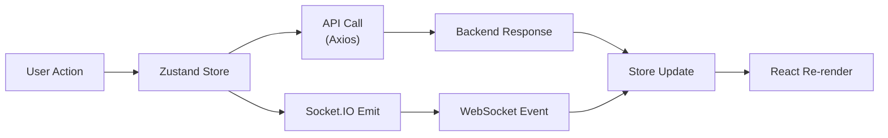

---

## Database Design

### Entity-Relationship Diagram

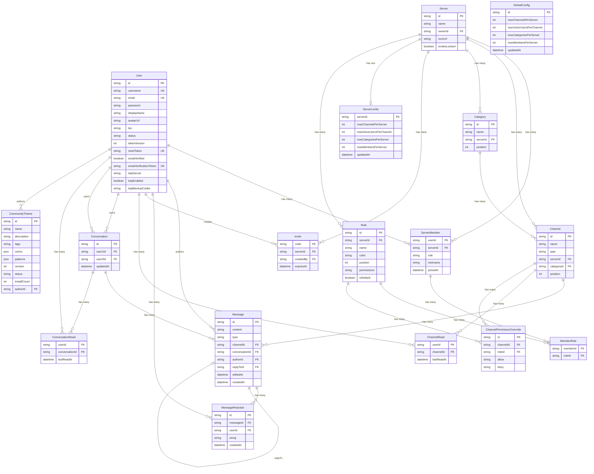

### Key Indexes

- `messages(channelId, createdAt)` — Fast message pagination per channel
- `messages(conversationId, createdAt)` — Fast message pagination per DM conversation
- `message_reactions(messageId)` — Reaction aggregation per message
- `message_reactions(messageId, userId, emoji)` UNIQUE — One reaction per user per emoji
- `users(username)` UNIQUE — Username lookup
- `users(email)` UNIQUE — Email lookup
- `users(reset_token)` UNIQUE — Password reset token lookup
- `users(email_verification_token)` UNIQUE — Email verification token lookup
- `server_members(userId, serverId)` COMPOSITE PK — Membership checks
- `channel_reads(userId, channelId)` COMPOSITE PK — Read position lookups
- `conversations(user1Id, user2Id)` UNIQUE — Conversation dedup
- `conversation_reads(userId, conversationId)` COMPOSITE PK — DM read positions
- `invites(code)` PK — Invite lookup
- `roles(serverId, position)` — Role hierarchy ordering
- `roles(serverId, name)` UNIQUE — Role name uniqueness per server
- `channel_permission_overrides(channelId, roleId)` UNIQUE — One override per role per channel
- `community_themes(status, installCount)` — Marketplace sort by popularity
- `community_themes(status, createdAt)` — Marketplace sort by newest
- `community_themes(authorId)` — User's own themes

### Scaling Considerations

- Messages use cursor-based pagination (`createdAt < ?`) instead of offset-based for consistent performance
- The `ServerMember` junction table allows efficient membership queries in both directions
- Channel positions are integer-based for simple reordering
- Unread counts computed via a single raw SQL query on connect, leveraging the existing `messages(channelId, createdAt)` index. `ChannelRead` table stores per-user read positions for persistence across sessions.

---

## Real-Time Communication

### Socket.IO Architecture

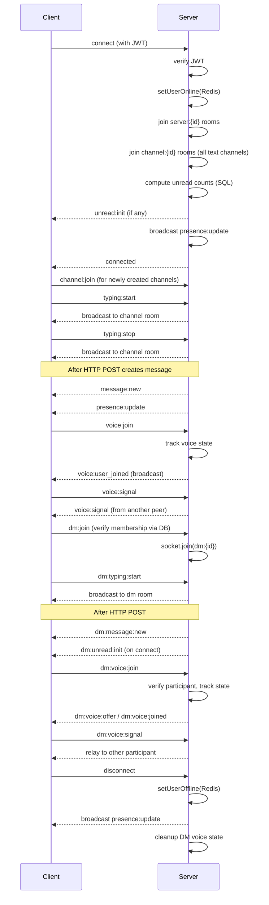

### Room Strategy

| Room Pattern | Purpose | When Joined |
|-------------|---------|-------------|
| `server:{id}` | Server-wide events (member join/leave, presence, voice) | On socket connect (all memberships) + dynamically on server create/join via `memberBroadcast.ts` |
| `channel:{id}` | Channel-specific events (messages, typing) | Auto-joined on socket connect for all text channels the user is a member of. Client also emits `channel:join` when selecting a channel (needed for channels created after connect). **Never left** — the socket stays subscribed for the connection's lifetime so `message:new` events reach the client for unread tracking. |
| `voice:{id}` | Voice channel (voice state, signaling) | Client emits `voice:join` when joining voice |
| `dm:{id}` | DM messages, typing, reactions | Auto-joined on socket connect for all conversations; `dm:join` emitted for new conversations. Authorization verified via DB query before joining. |
| `dm:voice:{id}` | DM call signaling | Joined on `dm:voice:join`, left on call end |

**Critical invariants:**
- Every code path that makes a user a server member (create, join, invite) must also add their socket(s) to the `server:{id}` room and seed `ChannelRead` records for all text channels (`lastReadAt = now()`). Failure to join the room breaks all server-scoped real-time features; missing ChannelRead records cause existing message history to show as unread.
- `channel:leave` must NOT be emitted by the client — it undoes the server's auto-subscription, breaking `message:new` delivery for that channel. Since the socket stays in all channel rooms, typing events are filtered by `channelId` on the frontend.
- `dm:join` must verify conversation membership via DB query before adding the socket to the room — prevents eavesdropping. `dm:typing` handlers must check `socket.rooms.has()` to prevent unauthorized emission.
- DM voice event handlers on the frontend must guard by `conversationId === dmCallConversationId` — the socket receives events for ALL conversations it's subscribed to, so unguarded handlers would leak voice events from other conversations into the active call state.
- Server voice and DM voice are mutually exclusive: `voice:join` on server triggers `leaveCurrentDMVoiceChannel()`, and `dm:voice:join` triggers `leaveCurrentVoiceChannel()`. Both server and client enforce this.

### Event Types

**Server → Client:**
- `message:new` / `message:update` / `message:delete` / `message:reaction_update`
- `channel:created` / `channel:deleted`
- `member:joined` / `member:left`
- `presence:update`
- `voice:user_joined` / `voice:user_left` / `voice:state_update` / `voice:speaking`
- `voice:signal` (WebRTC signaling relay)
- `voice:screen_share:start` / `voice:screen_share:stop` / `voice:screen_share:state`
- `typing:start` / `typing:stop`
- `server:updated` (server name/icon changed)
- `user:updated` (user displayName/avatar changed)
- `unread:init` (persistent unread counts on connect/reconnect)
- `dm:message:new` / `dm:message:update` / `dm:message:delete` / `dm:message:reaction_update`
- `dm:typing:start` / `dm:typing:stop`
- `dm:unread:init` (persistent DM unread counts)
- `dm:voice:offer` / `dm:voice:joined` / `dm:voice:left` / `dm:voice:ended`
- `dm:voice:state_update` / `dm:voice:speaking` / `dm:voice:signal`
- `dm:conversation:deleted`
- `friend:request_received` / `friend:request_accepted` / `friend:removed`
- `member:role_updated` / `member:kicked`
- `server:deleted`
- `category:created` / `category:updated` / `category:deleted`
- `channel:updated`

**Client → Server:**
- `channel:join` (for newly created channels only; `channel:leave` is NOT used — auto-subscription persists)
- `voice:join` / `voice:leave` / `voice:mute` / `voice:deaf` / `voice:speaking`
- `voice:signal` (WebRTC signaling relay)
- `voice:screen_share:start` / `voice:screen_share:stop`
- `typing:start` / `typing:stop`
- `dm:join` (join DM room for new conversation, with authorization check)
- `dm:typing:start` / `dm:typing:stop`
- `dm:voice:join` / `dm:voice:leave` / `dm:voice:mute` / `dm:voice:deaf` / `dm:voice:speaking`
- `dm:voice:signal` (WebRTC signaling relay for DM calls)

---

## Voice Architecture

### Current Implementation — mediasoup SFU

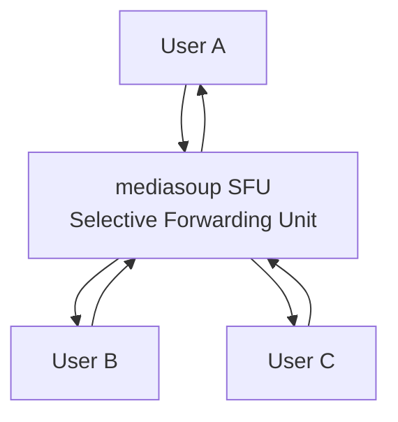

- Each client sends one upstream (Producer) to the SFU
- SFU selectively forwards streams to recipients via Consumers
- Each voice channel gets its own mediasoup Router (lazy-created, round-robin across Workers)
- Each user gets 2 WebRTC transports (send + recv), each using one UDP port from shared range
- Workers: 1 per CPU core (capped at 8), auto-restart on death
- Configuration: `MEDIASOUP_LISTEN_IP`, `MEDIASOUP_ANNOUNCED_IP` (LAN IP), `MEDIASOUP_MIN_PORT`/`MAX_PORT`
- Key files: `mediasoup/mediasoupManager.ts`, `mediasoup/mediasoupConfig.ts`, `websocket/voiceHandler.ts`

### Voice State Management

Voice state is tracked per-channel in memory:

```typescript
// Voice user state (includes mediasoup transports/producers/consumers)
Map<channelId, Map<userId, {
  socketId: string;
  selfMute: boolean;
  selfDeaf: boolean;
  sendTransport: WebRtcTransport | null;
  recvTransport: WebRtcTransport | null;
  producers: Map<string, Producer>;
  consumers: Map<string, Consumer>;
  rtpCapabilities: RtpCapabilities | null;
}>>

// Screen share state (one sharer per channel)
Map<channelId, userId>  // screenSharers
```

For multi-node deployment, this will migrate to Redis with pub/sub for cross-node synchronization.

### Resource Limits

Server resource limits are enforced dynamically via `utils/serverLimits.ts`:
- **Resolution order:** per-server override (`ServerLimits` table) > global config (`GlobalConfig` singleton) > hardcoded `LIMITS` constants
- **Defaults:** maxChannelsPerServer=20, maxVoiceUsersPerChannel=12, maxCategoriesPerServer=12, maxMembersPerServer=0 (unlimited)
- **Enforcement points:** channel creation, category creation, voice:join, invite join
- **Admin API:** `GET/PUT /admin/limits/global`, `GET/PUT/DELETE /admin/limits/servers/:serverId`
- **User API:** `GET /servers/:serverId/limits` (read-only, shown in ServerSettingsModal "Limits" tab)

### Screen Sharing

Screen sharing allows one user per voice channel to share their screen with all other participants using `getDisplayMedia` for capture:

- **Capture:** Browser/WebView2 native `getDisplayMedia()` API (hardware-accelerated, supports video + optional system audio)
- **Transport:** Video track produced as a mediasoup Producer with `appData: { type: 'screen' }`, consumed by all other channel users
- **One sharer per channel:** Server enforces via `screenSharers` Map; second start request is silently dropped
- **Late-joiner hydration:** `voice:join` handler emits `voice:screen_share:state` so users joining mid-share see the stream immediately
- **Viewer modes:** Inline (replaces ChatArea) or floating (draggable/resizable portal)
- **Cleanup:** Automatic stop on voice leave, disconnect, server deletion, or browser stop button (`track.onended`)

### DM Voice Calls (V0.5 - 1-on-1)

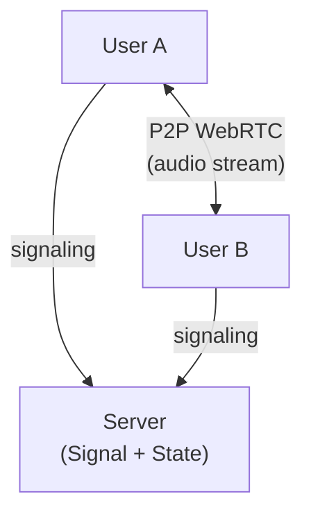

- WebRTC P2P (1-on-1 only) with self-hosted STUN for NAT traversal
- **Self-hosted STUN server** — coturn in STUN-only mode (`--stun-only --no-auth`) runs alongside the Voxium backend via docker-compose. STUN is stateless UDP (~100 bytes each way) that tells each peer its public IP:port — no media flows through it. Privacy-first: no third-party STUN/TURN servers. Frontend derives STUN URL from `VITE_WS_URL` hostname + port 3478.
- **Perfect Negotiation pattern** — resolves offer glare (both peers sending offers simultaneously) via polite/impolite roles based on userId comparison
- **Mutually exclusive** with server voice — joining one leaves the other (cross-cleanup on both server and client)
- In-memory state: `dmVoiceUsers` Map (conversationId → Map of userId → socketId) + `userDMCall` reverse lookup
- System messages ("Voice call started" / "Voice call ended") persisted to DB as `type: 'system'`
- Call offer broadcasts to `dm:{conversationId}` room; incoming call shown via `IncomingCallModal` with looping ringtone (stops on accept/decline/cancel)
- DM call UI has two layers: `DMCallPanel` renders inline in `DMChatArea` (full avatars + controls when viewing the conversation), and `DMVoicePanel` is a compact global panel rendered in both `ChannelSidebar` (after `VoicePanel`) and `DMList` so the user always sees their DM call status from any view

### Audio Processing Pipeline

Two cleanly separated pipelines (follows Jitsi/Matrix pattern):

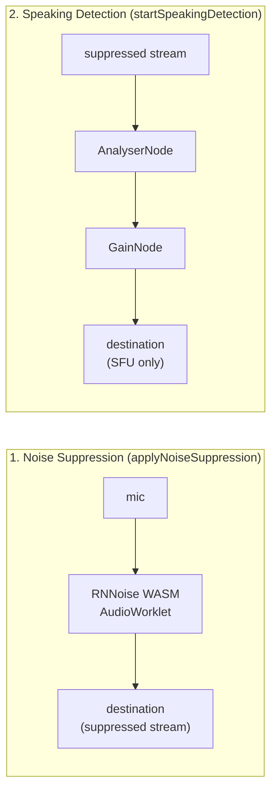

1. **Noise Suppression** (clean, isolated — `applyNoiseSuppression()`):
   Uses `@timephy/rnnoise-wasm` (fork of `@jitsi/rnnoise-wasm`) with the Jitsi `NoiseSuppressorWorklet` (circular buffer, LCM-based sizing, 480-sample frame handling). Nothing else in the audio path. Returns a clean suppressed stream used by both SFU producers and DM P2P peers.

2. **Speaking Detection** (read-only side-chain — `startSpeakingDetection()`):
   Taps into the already-suppressed stream. The gain gate only matters for SFU producer pause/resume (saves bandwidth). DM mode bypasses the gain gate — DM uses the suppressed stream directly.

- **Live toggle:** Noise suppression can be enabled/disabled mid-call. A generation counter prevents race conditions on rapid toggles.
- **Push-to-talk:** Works in both server voice and DM calls. PTT overrides mute — pressing the key temporarily enables the mic regardless of mute state. `pttActive` store state drives the speaking indicator so the green ring shows during PTT even when muted.
- **Browser noiseSuppression inversion:** When RNNoise is enabled, the browser's built-in `noiseSuppression` getUserMedia constraint is disabled to avoid double-processing.

---

## Authentication & Security

### JWT Token Flow

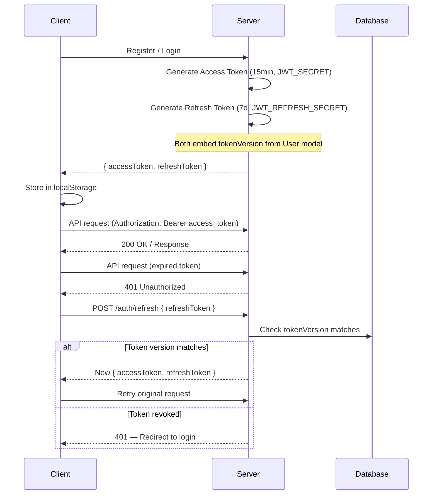

### Password Reset Flow

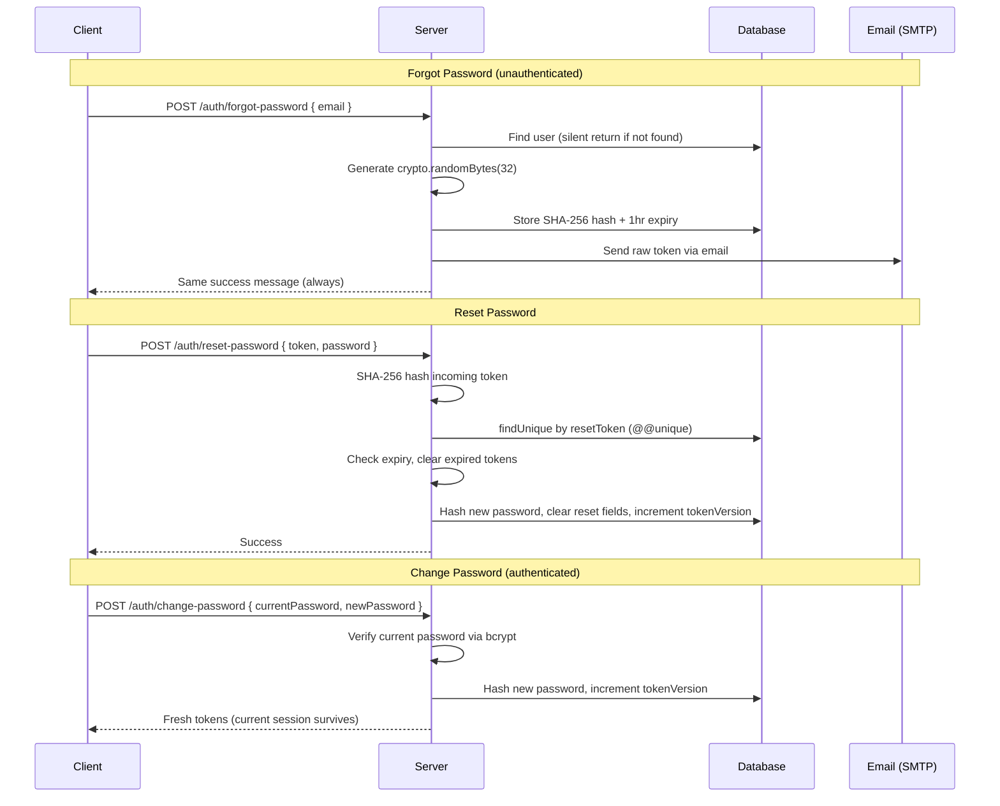

### Email Verification Flow

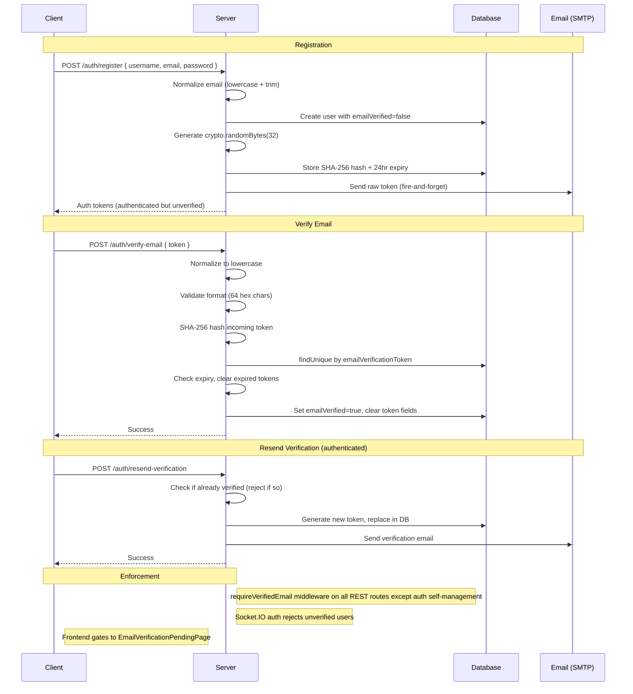

### Security Measures

| Layer | Protection |
|-------|-----------|
| Transport | HTTPS in production |
| Headers | Helmet.js (CSP, HSTS, X-Frame, etc.) + Tauri CSP (restrictive `connect-src`, `script-src`, etc.) |
| Auth | JWT with short expiry + refresh rotation + tokenVersion invalidation + `algorithms: ['HS256']` pinning + purpose field rejection (prevents token type confusion) |
| Passwords | bcrypt with 12 salt rounds, PASSWORD_MAX=72 (matches bcrypt's actual input limit) |
| Password Reset | SHA-256 hashed tokens, 1hr expiry, single-use, anti-enumeration |
| Email Verification | SHA-256 hashed tokens, 24hr expiry, single-use, format validation (64 hex chars, lowercase normalized), `requireVerifiedEmail` on all functional routes + attachment proxy + Socket.IO, StrictMode double-POST guard, migration preflight duplicate check |
| Registration | Generic "Username or email already in use" error prevents email enumeration; email normalized to lowercase; Nodemailer structured address prevents header injection |
| CORS | Explicit origin whitelist (must include Tauri origins: `https://tauri.localhost` Win, `tauri://localhost` macOS, `http://tauri.localhost` Linux). No `withCredentials` on client (Bearer tokens, not cookies) — avoids strict CORS mode that breaks on custom protocol origins. Server CORS echoes first allowed origin on null-origin requests instead of `*` |
| Input | Server-side validation on all endpoints + runtime type validation on all Socket.IO payloads |
| SQL Injection | Prisma parameterized queries |
| IDOR | Message edit/delete verify channelId match + server membership; cross-channel manipulation blocked |
| WebSocket | JWT verification on connection + purpose field rejection + runtime payload validation |
| Input Sanitization | HTML tag stripping + trim on all user-generated text (defense-in-depth) |
| Rate Limiting | rate-limiter-flexible with Redis (per-endpoint + per-socket), fail-open with in-memory fallback; complete coverage on all write endpoints and socket events |
| TOTP 2FA | AES-256-GCM encrypted secrets at rest (`TOTP_ENCRYPTION_KEY`), bcrypt-hashed backup codes, 30-day trusted device JWTs with tokenVersion validation, dedicated rate limiter, Redis-based replay protection (90s TTL) |
| Admin | Role hierarchy enforcement — admins cannot ban/delete peer admins (superadmin required) |
| S3 Uploads | Presigned PUT URLs enforce Content-Type via `signableHeaders`; proxy streaming for attachments (S3 URL never exposed) |
| Trust Proxy | Conditional on `NODE_ENV=production` or `TRUST_PROXY=true` — prevents IP spoofing in dev |
| CI/CD | GitHub Actions use env vars for attacker-controlled context (never interpolated in `run:`) |

### TOTP Two-Factor Authentication Flow

```
Setup (authenticated):
  POST /auth/totp/setup
    → Generate 20-byte secret (otpauth library)
    → Encrypt secret with AES-256-GCM → store in user.totpSecret
    → Return base32 secret + QR code data URL

  POST /auth/totp/enable { code }
    → Decrypt stored secret, validate TOTP code (window: 1)
    → Generate 8 backup codes → bcrypt hash each → store in user.totpBackupCodes
    → Set totpEnabled = true
    → Return plaintext backup codes (shown once)

Login with TOTP:
  POST /auth/login { email, password, trustedDeviceToken? }
    → Verify credentials
    → If trustedDeviceToken valid (30d JWT, matching tokenVersion) → skip TOTP
    → If totpEnabled → return { totpRequired: true, totpToken } (no auth tokens)

  POST /auth/totp/verify { totpToken, code }
    → Validate totpToken JWT (5min expiry, purpose: 'totp')
    → Try TOTP code first; if invalid try backup codes
    → Backup code match: remove atomically via optimistic concurrency
    → Return { accessToken, refreshToken, trustedDeviceToken }

Disable (authenticated):
  POST /auth/totp/disable { code }
    → Accept either TOTP code or backup code
    → Clear totpEnabled, totpSecret, totpBackupCodes
```

### Permission Model

```
Owner  → Full server control (delete server, manage all)
Admin  → Create/delete channels, manage messages
Member → Send messages, join voice, use invites
```

Checked server-side on every request via `ServerMember.role`.

### Feature Flags

Redis-backed feature flag system for toggling features without redeployment:

```
Redis Hash: feature:flags
┌─────────────────┬─────────┐
│ registration    │ true    │  ← Gate: POST /auth/register
│ invites         │ true    │  ← Gate: POST /invites/servers/:id, POST /invites/:code/join
│ server_creation │ true    │  ← Gate: POST /servers
│ voice           │ true    │  ← Gate: voice:join socket event
│ dm_voice        │ true    │  ← Gate: dm:voice:join socket event
│ support         │ true    │  ← Gate: POST /support/open
└─────────────────┴─────────┘
```

- Defaults defined in `featureFlags.ts`, overrides persisted to Redis `feature:flags` hash
- In-memory cache for zero-latency checks via `isFeatureEnabled(name)`
- Loaded on server startup via `loadFeatureFlags()`
- Admin API: `GET/PUT /feature-flags/:name`, `POST /feature-flags/:name/reset`
- Changes take effect immediately (no restart needed)

### Rate Limit Registry

All 18 rate limiters are registered in a central `DEFAULTS` record with admin-editable overrides:

```
Redis Hash: rl:config
┌────────────────┬───────────────────────┐
│ limiter name   │ {points, duration,    │
│                │  blockDuration}       │
└────────────────┴───────────────────────┘
```

- Overrides loaded from Redis on startup, cached in memory
- Limiter instances nulled on config change → recreated on next request
- Admin API: `GET /rate-limits`, `PUT /rate-limits/:name`, `POST /rate-limits/:name/reset`, `POST /rate-limits/clear-user`

### Server Invite Lock

Per-server invite control independent of the global `invites` feature flag:

- `Server.invitesLocked` boolean field (default `false`)
- Owners and admins can toggle via `PATCH /servers/:id/invites-lock`
- Checked on invite creation and invite join (returns 403 when locked)
- Broadcast to all members via `server:updated` socket event

---

## Admin Dashboard

Standalone React app (`apps/admin/`, port 8082) with two-tier role system:

```
apps/admin/
├── src/
│   ├── stores/
│   │   ├── authStore.ts     # Admin login (admin + superadmin roles)
│   │   └── adminStore.ts    # All admin state + actions (Zustand)
│   ├── components/
│   │   ├── AdminLayout.tsx         # Sidebar nav + content router
│   │   ├── AdminDashboard.tsx      # Stats cards + REST metrics + SFU stats + charts
│   │   ├── AdminReports.tsx        # Moderation queue (pending/resolved/dismissed)
│   │   ├── AdminSupportTickets.tsx # Support ticket queue + chat panel
│   │   ├── AdminUserList.tsx       # Paginated user management
│   │   ├── AdminServerList.tsx     # Paginated server management + global/per-server resource limits
│   │   ├── AdminBanList.tsx        # User bans + IP bans
│   │   ├── AdminAnnouncements.tsx  # Global/targeted announcements
│   │   ├── AdminStorage.tsx        # S3 storage stats (avatars, server icons, attachments, orphans) + file browser with type/status filters + delete/cleanup actions
│   │   ├── AdminRateLimits.tsx     # Rate limit controls (edit/reset rules, clear user counters)
│   │   ├── AdminFeatureFlags.tsx   # Feature flag toggles
│   │   ├── AdminAuditLog.tsx       # Searchable/filterable audit trail
│   │   └── AdminDataTools.tsx      # CSV/JSON data export
│   └── services/
│       ├── api.ts           # Axios with token interceptor
│       └── socket.ts        # Socket.IO for real-time admin events
```

### Admin Permission Model

| Action | admin | superadmin |
|--------|-------|------------|
| Full dashboard access | Yes | Yes |
| Ban/unban/delete users, servers | Yes | Yes |
| Manage reports, support tickets | Yes | Yes |
| Edit rate limits, feature flags | Yes | Yes |
| Promote/demote staff roles | No | Yes |

### Admin Real-Time Events

- **Dashboard metrics** — fetched via REST (`GET /admin/stats/live`, `GET /admin/stats/sfu`) with refresh buttons. SFU stats include per-worker transport counts, port utilization, producers/consumers.
- `admin:reports` — Socket.IO subscription for new report notifications → auto-refresh
- `admin:support` — Socket.IO subscription for new ticket/message notifications → auto-refresh

### Admin Resource Limits

Admins can control server resource allocation:
- **Global limits** (`GET/PUT /admin/limits/global`) — defaults applied to all servers
- **Per-server overrides** (`GET/PUT/DELETE /admin/limits/servers/:serverId`) — nullable fields override global (null = use global)
- Resolution: server override > global config > hardcoded `LIMITS` constants
- Managed in AdminServerList: collapsible global limits panel + per-server settings modal

### Admin Storage Management

Admin dashboard storage page provides full visibility into S3 usage:
- **Stat cards** — Total storage, avatars, server icons, attachments, orphaned files (count + size)
- **Top uploaders** — Users and servers ranked by total storage consumption (avatars + server icons + message attachments aggregated from S3 keys and DB records)
- **File browser** — Filterable table (all/avatars/server-icons/attachments/orphaned) with type badges, status badges (Active/Orphaned/Expired), linked entity display, and per-file delete
- **Bulk cleanup** — Delete all orphaned files (files in S3 not referenced by any DB record)
- **Delete behavior** — Avatar/server-icon deletion removes from S3 and clears the DB reference; attachment deletion marks as `expired: true` in DB (soft-delete) so the chat UI shows an "Expired" placeholder instead of a broken link

### Attachment Lifecycle

Message attachments follow a 3-day retention lifecycle:

1. **Upload** — Client requests presigned PUT URL (`POST /uploads/presign/attachment`), uploads directly to S3. Server validates file type, size, and authorization (server membership or DM participation). S3 key includes context prefix (`attachments/ch-{channelId}/` or `attachments/dm-{conversationId}/`)
2. **Access** — Attachments are proxied through the server (`GET /uploads/attachments/*`) — S3 URLs never reach the client. Authorization is checked per-request (server member or DM participant). Self-healing: if S3 returns `NoSuchKey`, the attachment is auto-marked as expired
3. **Expiry** — A scheduled cleanup job runs daily at 4 AM. It queries `MessageAttachment` records older than `ATTACHMENT_RETENTION_DAYS` (default: 3), marks them as `expired: true` in the DB, then deletes the S3 objects. DB records are preserved for the "Expired" UI placeholder
4. **Report** — After each cleanup run, an email report is sent to `CLEANUP_REPORT_EMAIL` with: status, duration, files expired, storage freed, remaining active attachments, and any errors

### Desktop Notifications

3-tier notification system with avatar support (`services/notifications.ts`):

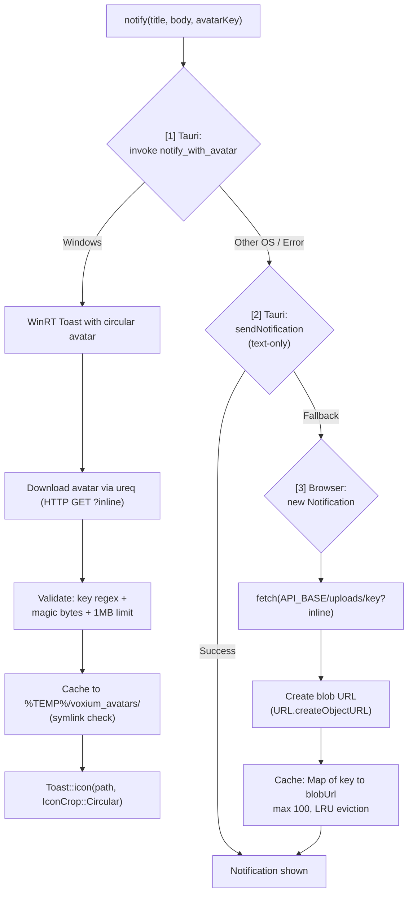

**Security:**
- All Tauri-specific code gated behind `TAURI_AVAILABLE` (`'__TAURI_INTERNALS__' in window`)
- **System tray:** graceful creation — if `TrayIconBuilder::build()` fails (Linux GNOME/Wayland without `libappindicator`), app continues without tray. Close behavior adapts: tray available → hide to tray; no tray → `app.exit(0)` (quit cleanly)
- Avatar key validated against `VALID_AVATAR_KEY_RE` on both frontend (JS regex) and backend (Rust regex)
- Rust: null byte rejection, control char rejection, 128-char key limit, image magic byte validation (PNG/JPEG/WebP/GIF), symlink detection on cached files
- Server: `?inline` proxy forces `Content-Type: image/webp`, `X-Content-Type-Options: nosniff`, `Content-Disposition: inline`

### Presence Cleanup

`clearPresenceState()` in `utils/redis.ts` prevents ghost online statuses:
- Collects all user IDs from Redis `online_users` set
- Deletes per-user socket sets (`user:sockets:{userId}`)
- Clears global keys (`online_users`, `socket:users`)
- Resets all DB users with `status: 'online'` to `'offline'`
- Called on server startup (before accepting connections) and graceful shutdown

### Email System

Nodemailer transporter (`utils/email.ts`) with configurable SMTP:
- **Password reset emails** — HTML + plaintext with reset link, 1hr expiry
- **Cleanup report emails** — HTML + plaintext summary table sent to `CLEANUP_REPORT_EMAIL` after each daily attachment cleanup run

### Community Themes

User-created themes with a marketplace for sharing. Themes customize all `--vox-*` CSS custom properties and optional SVG background patterns.

**Data Model** (`CommunityTheme`):
- `colors` (JSON) — key-value map of `--vox-*` CSS variable overrides (validated against `THEME_COLOR_KEYS` from shared)
- `patterns` (JSON, optional) — per-area SVG background patterns for sidebar, channel, chat (type: `none` | `svg`, sanitized via `sanitizeSvg()`)
- `status`: `draft` → `published` → `removed` (admin moderation)
- `installCount` — atomic increment/decrement on install/uninstall
- Composite unique: `[authorId, name]`; indexed on `[status, installCount]` and `[status, createdAt]`

**API Routes** (`/api/v1/themes`):
| Route | Purpose |
|-------|---------|
| `GET /` | Browse published themes (paginated, sort by newest/popular/name, search by name, filter by tag) |
| `GET /mine` | List current user's themes (all statuses) |
| `GET /:themeId` | Get single theme (published or own) |
| `POST /` | Create theme (draft) — validates name, description, tags, colors, patterns |
| `PATCH /:themeId` | Update own theme |
| `DELETE /:themeId` | Delete own theme |
| `POST /:themeId/publish` | Publish draft theme to marketplace |
| `POST /:themeId/unpublish` | Revert to draft |
| `POST /:themeId/install` | Install theme (increments installCount) |
| `POST /:themeId/uninstall` | Uninstall theme (decrements installCount) |
| `POST /:themeId/remove` | Admin: remove from marketplace |

**Frontend Engine** (`services/themeEngine.ts`):
- `applyCustomThemeColors()` — sets `data-theme="custom"` + injects `--vox-*` inline styles on `<html>`
- `applyCustomPatterns()` — injects a `<style id="vox-custom-patterns">` tag with per-area SVG background rules
- `clearCustomThemeColors()` — removes custom properties, restores built-in theme
- Built-in themes (`styles/themes.css`): dark (default), light, midnight, tactical — applied via `[data-theme]` CSS selectors

**Frontend UI** (`components/settings/ThemeEditor.tsx`, `ThemeBrowser.tsx`):
- **ThemeEditor** — live preview with color pickers for all `--vox-*` variables, pattern config per area, JSON import/export
- **ThemeBrowser** — marketplace grid with search, tag filter, sort, install/uninstall tracking
- Settings modal appearance tab: built-in theme selector + custom theme management

**Rate limiting:** `rateLimitThemeManage` (write operations), `rateLimitThemeBrowse` (read operations)

### Internationalization (i18n)

11 languages with RTL support, fully client-side via `i18next` + `react-i18next`.

**Supported Languages:**
`en`, `fr`, `es`, `pt`, `de`, `ru`, `uk`, `ko`, `zh`, `ja`, `ar` (RTL)

**Architecture:**
- Static JSON bundles per language in `i18n/locales/*.json` (~800+ keys each)
- `i18next-browser-languagedetector` for auto-detection (order: `localStorage` → `navigator`)
- Language persisted in `localStorage` key `voxium_language`
- RTL handled via `document.documentElement.dir = 'rtl'` on language change (Arabic)
- Server error messages mapped to i18n keys via `utils/serverErrors.ts` (130+ mappings) — `getTranslatedError()` translates API error responses for display

**Key design decisions:**
- All translations are client-side (no server-side i18n) — backend returns English error strings, frontend maps them to localized keys
- Fallback: `en` for any missing key in other languages
- Direction attribute removed (not set to `ltr`) for LTR languages to avoid Tailwind 4 logical property issues

---

## Scalability Strategy

### Phase 1: Single Node (1K users)
- Single Node.js process
- PostgreSQL + Redis on same machine or nearby
- In-memory voice state
- Simple deployment

### Phase 2: Multi-Node (10K users)

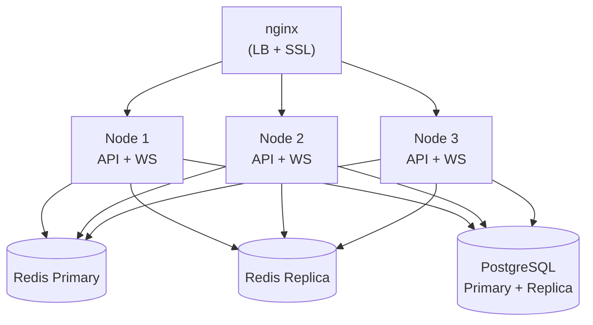

Key changes:
- Socket.IO with Redis adapter for cross-node event distribution
- Voice state in Redis
- Sticky sessions for WebSocket connections (IP hash or cookie)
- Connection pooling for PostgreSQL

### Phase 3: Microservices (100K+ users)

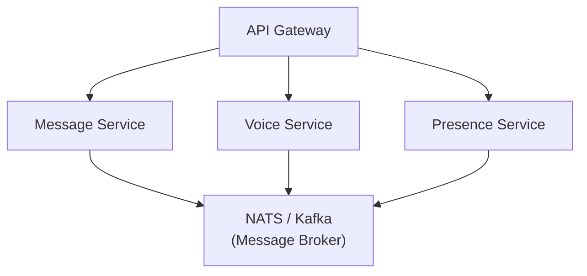

- Break into domain microservices
- Event-driven architecture with message broker
- Independent scaling of voice vs. text vs. API
- Dedicated media servers for voice/video

### Phase 4: Discord-Scale (Millions)

- Global edge network (CDN + edge compute)
- Regional data centers
- Database sharding by server_id
- Dedicated media infrastructure
- Global service mesh
- Multi-region Redis clusters

---

## Deployment Architecture

### Development
```bash
docker compose up -d     # PostgreSQL + Redis
pnpm dev                 # Backend + Frontend
```

### Production (Docker)

```dockerfile
# apps/server/Dockerfile (future)
FROM node:20-alpine
WORKDIR /app
COPY package.json pnpm-lock.yaml ./
RUN pnpm install --frozen-lockfile --prod
COPY dist/ ./dist/
COPY prisma/ ./prisma/
RUN npx prisma generate
CMD ["node", "dist/index.js"]
```

### Production (Kubernetes) — Future

```yaml
# Simplified deployment structure
API Deployment (3+ replicas)
  └── Service (ClusterIP)
      └── Ingress (nginx)

PostgreSQL StatefulSet
  └── PersistentVolumeClaim

Redis Deployment
  └── Service (ClusterIP)

mediasoup Deployment (autoscaling)
  └── Service (NodePort for UDP)
```

---

## Future Architecture

### Planned Features & Their Architectural Impact

| Feature | Architecture Change |
|---------|-------------------|
| **Video calls** | mediasoup SFU with video codecs (VP8/VP9/H264) |
| **~~Screen sharing~~** | ~~mediasoup producer for screen capture~~ **Implemented (v0.9.6)** — `getDisplayMedia()` capture with WebRTC P2P track forwarding; one sharer per channel; inline + floating viewer modes |
| **~~Direct Messages~~** | ~~New DM channel type, conversation model~~ **Implemented (v0.5.0–v0.7.0)** — 1-on-1 text + voice with `Conversation` model, real-time delivery, typing, reactions, unread tracking, WebRTC P2P calls, conversation deletion with cascade + real-time sync |
| **~~File uploads~~** | ~~S3-compatible object storage~~ **Implemented (v0.3.2, migrated v0.9.1, attachments v1.2.0)** — presigned URL direct-to-S3 uploads for avatars, server icons, and message attachments; attachments proxied through server (S3 URL never exposed); 3-day retention with daily 4 AM cleanup job + email report; soft-delete preserves DB records for "Expired" UI placeholders |
| **~~Password reset~~** | ~~Email-based reset flow~~ **Implemented (v0.4.0)** — Nodemailer + SHA-256 hashed tokens + tokenVersion-based session invalidation |
| **~~Push notifications~~** | ~~FCM/APNs integration service~~ **Partially implemented (v1.2.1)** — Native OS notifications with avatar support (WinRT toast on Windows, Web Notification API in browser); FCM/APNs for mobile remains future work |
| **~~Message search~~** | ~~Elasticsearch / PostgreSQL full-text search~~ **Implemented (v0.9.5)** — PostgreSQL case-insensitive `contains` search across server channels and DM conversations; cursor-based pagination; "around" mode for jump-to-message with scroll + highlight |
| **Mobile app** | React Native sharing stores/services with web |
| **Bot API** | Gateway API for third-party integrations |
| **End-to-end encryption** | Signal Protocol for DMs |
| **CDN** | CloudFront/Cloudflare for static assets + media |

### Mobile Strategy

The frontend architecture is designed for code sharing:

```
packages/shared/     → Types, validators, constants (shared)
packages/ui/         → UI components (future, shared)
apps/desktop/        → Tauri + React (desktop)
apps/mobile/         → React Native (future)
apps/web/            → React SPA (ships today, same code as desktop minus Tauri)
```

Zustand stores and service layer (API + Socket) are framework-agnostic and can be reused across all platforms.
